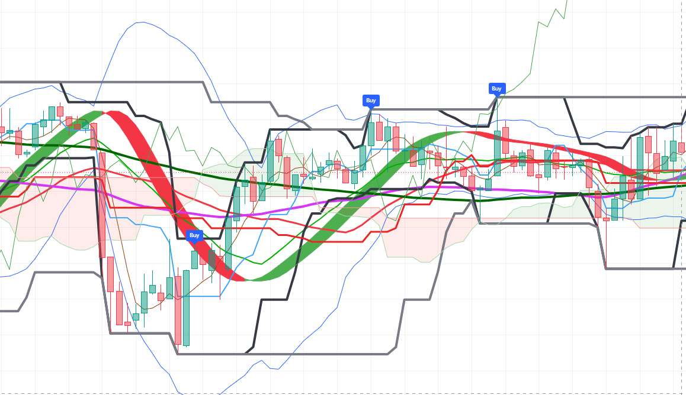

## Pine-Script-Technical-Indicator
First pine script indicator

## Project Overview
This project focuses on the design, mathematical modeling, and statistical backtesting of a trading strategy for cryptocurrency markets. Built using TradingView's Pine Script, the algorithm aims to capture trend momentum while minimizing risk. It includes about 5 existing strategies, which are used to find the best entry price with the least risk and the highest return. 

--

## Hypothesis & Mathematical Logic
- Indicators used: Bollinger Band, Smooth Moving Average, Price Channel, Hull Suite, and Ichimoku
- Signal logic: If the previous bar follows the trend and is at the start of the trend line, label the current bar "buy" or "sell" depending on the context.

--

## Features
- "buy" signal: triggers when the price is at the start of the rising trend and has detected the conversion point of the trend from decline to rise.
- "sell" signal: triggers when the price is at the start of the falling trend and has detected the conversion point of the trend from rise to decline.
- The signal is represented by a label on top of the current bar, which also changes color depending on which signal it is.

-- 

## How to Use in TradingView
- Open www.tradingview.com
- Open any chart
- Click on the "Pine Editor" tab at the bottom
- Copy the code from "FSFOF.txt" in this repository and paste it into the editor
- Click "Add to Chart" and save it.

--

## What I Learned
- Code that determines the color and shape of the signal
- If-Else statements in context
- Importing other indicators into my own
- Signal-to-Noise Ratio: Adding too many lines of code causes lagging problems, which delays the script itself. Decreases accuracy rather than increasing it.
